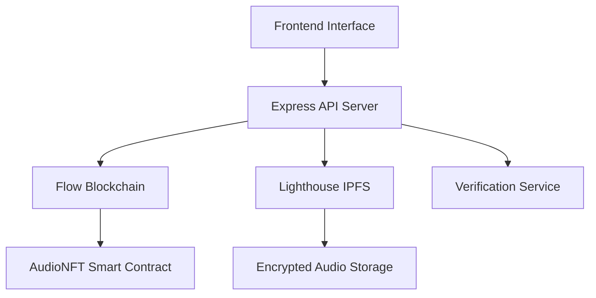

# 🎵 SONIC - Audio Tokenization Platform

<div align="center">
  
  
  
  
</div>

## 🚀 Overview

**SONIC** is a decentralized audio tokenization platform that empowers creators to securely store, tokenize, and monetize their audio assets on the blockchain. Built on Flow blockchain with IPFS storage via Lighthouse SDK, SONIC enables creators to mint NFTs from their audio content while maintaining privacy and ownership rights.

### ✨ Key Features

- 🔐 **Secure Audio Storage**: Client-side encryption with decentralized IPFS storage
- 🎨 **NFT Minting**: Tokenize audio assets as NFTs on Flow blockchain
- 👤 **Identity Verification**: Human identity verification for authentic creators
- 📊 **Rich Metadata**: Store demographic and audio attributes
- 🌐 **Dual Interface**: Separate portals for creators and consumers
- 💰 **Monetization**: License and sell audio assets with smart contracts

## 🏗️ Architecture



## 📁 Project Structure

```
SONIC/
├── 📂 backend/                    # Backend services and smart contracts
│   ├── 📂 src/                   # Source code
│   │   ├── 📂 controllers/       # API route handlers
│   │   │   ├── 📄 audioController.js      # Audio upload & NFT minting
│   │   │   ├── 📄 nftController.js        # NFT management
│   │   │   └── 📄 verificationController.js # Identity verification
│   │   ├── 📂 services/          # Business logic layer
│   │   │   ├── 📄 flow-service.js         # Flow blockchain integration
│   │   │   ├── 📄 lighthouse-service.js   # IPFS storage service
│   │   │   └── 📄 VerificationServices.js # Identity verification logic
│   │   ├── 📂 models/            # Data models
│   │   │   ├── 📄 User.js                 # User data model
│   │   │   └── 📄 DocumentProcessor.js    # Document processing
│   │   ├── 📂 middleware/        # Express middleware
│   │   │   ├── 📄 errorHandler.js         # Global error handling
│   │   │   └── 📄 validation.js           # Request validation
│   │   ├── 📂 utils/             # Helper functions
│   │   │   ├── 📄 constants.js            # Application constants
│   │   │   ├── 📄 helpers.js              # Utility functions
│   │   │   └── 📄 logger.js               # Logging utility
│   │   ├── 📂 config/            # Configuration files
│   │   │   ├── 📄 database.js             # Database configuration
│   │   │   ├── 📄 flow.json               # Flow blockchain config
│   │   │   └── 📄 multer.js               # File upload config
│   │   └── 📄 server.js          # Main server entry point
│   ├── 📂 contracts/             # Cadence smart contracts
│   │   └── 📄 AudioNFT.cdc       # Audio NFT smart contract
│   ├── 📂 scripts/               # Deployment & utility scripts
│   │   ├── 📄 deploy.js          # Contract deployment
│   │   └── 📄 testMint.js        # Testing script
│   ├── 📂 tests/                 # Test files (to be added)
│   ├── 📂 docs/                  # Backend documentation
│   │   └── 📄 API.md             # API documentation
│   ├── 📄 package.json           # Backend dependencies
│   └── 📄 .env.example           # Environment variables template
│
├── 📂 frontend/                   # Frontend application (React/Next.js)
│   ├── 📂 src/                   # Source code
│   ├── 📄 package.json           # Frontend dependencies
│   └── 📄 .env.example           # Frontend environment template
│
├── 📂 docs/                      # Project documentation
│   └── 📄 API-Spec.md            # API specifications
│
├── 📄 README.md                  # This file
├── 📄 LICENSE                    # MIT License
└── 📄 .gitignore                 # Git ignore rules
```

## 🛠️ Tech Stack

### Backend
- **Runtime**: Node.js with Express.js
- **Blockchain**: Flow blockchain with Cadence smart contracts
- **Storage**: IPFS via Lighthouse SDK
- **File Upload**: Multer for handling audio files
- **Authentication**: Custom verification service

### Frontend
- **Framework**: React/Next.js (planned)
- **Wallet Integration**: Flow wallet connectivity
- **UI/UX**: Modern responsive design

### Smart Contracts
- **Language**: Cadence (Flow blockchain)
- **Standard**: NonFungibleToken interface
- **Features**: Audio NFT minting with metadata

## 🚀 Quick Start

### Prerequisites

- Node.js (v16 or higher)
- npm or yarn
- Flow CLI (for smart contract deployment)
- Lighthouse API key

### Installation

1. **Clone the repository**
   ```bash
   git clone https://github.com/your-username/SONIC.git
   cd SONIC
   ```

2. **Backend Setup**
   ```bash
   cd backend
   npm install
   
   # Copy and configure environment variables
   cp .env.example .env
   # Edit .env with your configuration
   ```

3. **Frontend Setup**
   ```bash
   cd ../frontend
   npm install
   
   # Copy and configure environment variables
   cp .env.example .env
   # Edit .env with your configuration
   ```

### Configuration

#### Backend Environment Variables

```bash
# Flow Configuration
FLOW_NETWORK=testnet
FLOW_RPC_URL=https://access-testnet.onflow.org
FLOW_PRIVATE_KEY=your_flow_private_key_here
FLOW_CONTRACT_ADDRESS=your_contract_address_here

# Lighthouse Configuration  
LIGHTHOUSE_API_KEY=your_lighthouse_api_key_here

# API Configuration
PORT=3001
```

### Running the Application

1. **Start the Backend Server**
   ```bash
   cd backend
   npm run dev
   ```
   The API server will start on `http://localhost:3001`
   
   Available endpoints:
   - Health check: `GET /health`
   - Audio upload: `POST /api/audio/upload`
   - NFT minting: `POST /api/audio/mint`
   - User verification: `POST /api/verification/initiate`

2. **Deploy Smart Contracts** (First time only)
   ```bash
   cd backend
   npm run deploy
   ```

3. **Test the API** (Optional)
   ```bash
   cd backend
   npm test
   ```

4. **Start the Frontend** (When available)
   ```bash
   cd frontend
   npm run dev
   ```

## 📡 API Endpoints

### Health Check
```http
GET /health
```
Returns the status of all services.

### Audio Upload & Minting
```http
POST /upload-and-mint
Content-Type: multipart/form-data

Parameters:
- audio: Audio file (up to 50MB)
- metadata: JSON string with audio metadata
```

### Verification
```http
POST /verify-identity
Content-Type: multipart/form-data

Parameters:
- documents: Identity verification documents
- userData: User information JSON
```

## 🔧 Development Workflow

### For Backend Developers

1. Work primarily in the `/backend` directory
2. Develop and test Cadence smart contracts
3. Implement API endpoints for frontend consumption
4. Handle IPFS storage and encryption
5. Manage identity verification workflows

### For Frontend Developers

1. Work primarily in the `/frontend` directory
2. Implement user interfaces for creators and consumers
3. Integrate with backend APIs
4. Handle wallet connections and transactions
5. Create responsive and intuitive UX

### Collaboration Guidelines

- Use feature branches for development
- Create pull requests for code review
- Update API documentation in `/docs/API-Spec.md`
- Follow conventional commit messages
- Test thoroughly before merging

## 🧪 Testing

```bash
# Backend tests
cd backend
npm test

# Smart contract tests
flow test
```

## 📚 Smart Contract Details

### AudioNFT Contract

The `AudioNFT.cdc` contract implements:

- **NFT Standard**: Follows Flow's NonFungibleToken interface
- **Metadata Storage**: Rich metadata including IPFS CID and audio attributes
- **Minting**: Controlled minting with verification
- **Events**: Comprehensive event logging for transparency

### Key Functions

- `mintNFT()`: Mint new audio NFT with metadata
- `borrowAudioNFT()`: Borrow reference to audio NFT
- `getMetadata()`: Retrieve NFT metadata

## 🤝 Contributing

We welcome contributions! Please follow these steps:

1. Fork the repository
2. Create a feature branch (`git checkout -b feature/amazing-feature`)
3. Commit your changes (`git commit -m 'Add amazing feature'`)
4. Push to the branch (`git push origin feature/amazing-feature`)
5. Open a Pull Request

### Code Style

- Use ESLint for JavaScript code formatting
- Follow Cadence best practices for smart contracts
- Write clear, descriptive commit messages
- Add tests for new features

## 📄 License

This project is licensed under the MIT License - see the [LICENSE](LICENSE) file for details.

## 🆘 Support

- 📧 **Email**: support@sonic-platform.com
- 💬 **Discord**: [Join our community](https://discord.gg/sonic)
- 📖 **Documentation**: [Full docs](./docs/)
- 🐛 **Issues**: [GitHub Issues](https://github.com/your-username/SONIC/issues)

## 🗺️ Roadmap

- [ ] Complete frontend implementation
- [ ] Advanced audio analytics
- [ ] Multi-chain support
- [ ] Mobile application
- [ ] Marketplace features
- [ ] Creator royalty system

---

<div align="center">
  <p>Built with ❤️ by the SONIC Team</p>
  <p>Empowering creators through decentralized audio tokenization</p>
</div>

